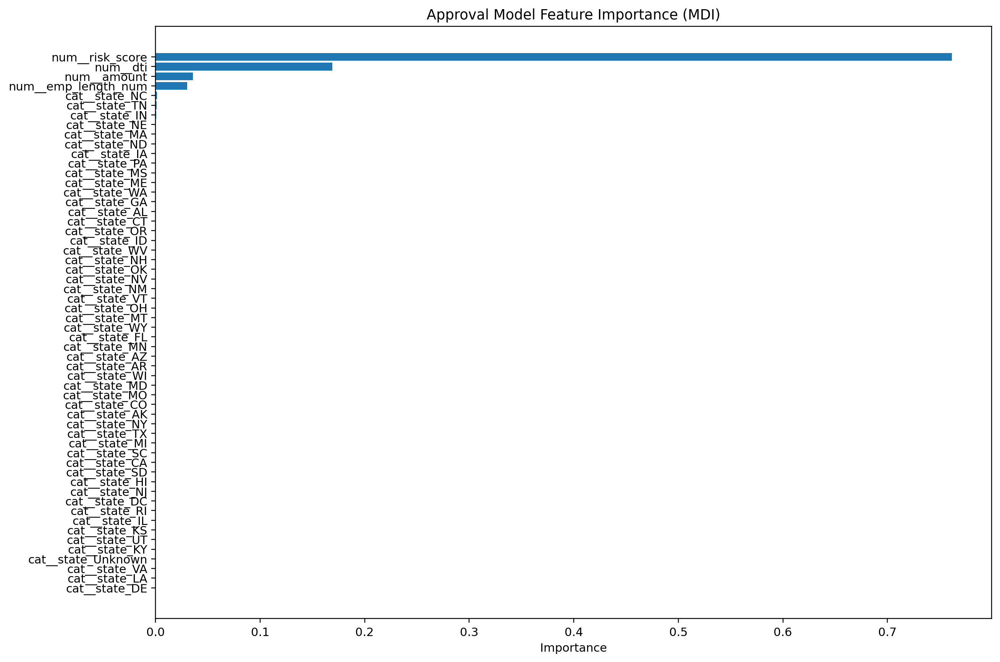
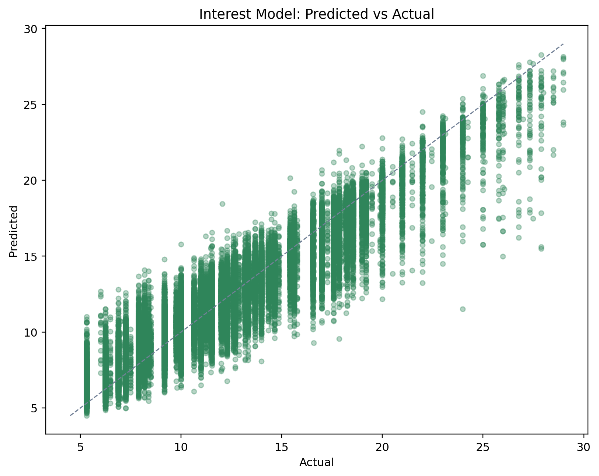
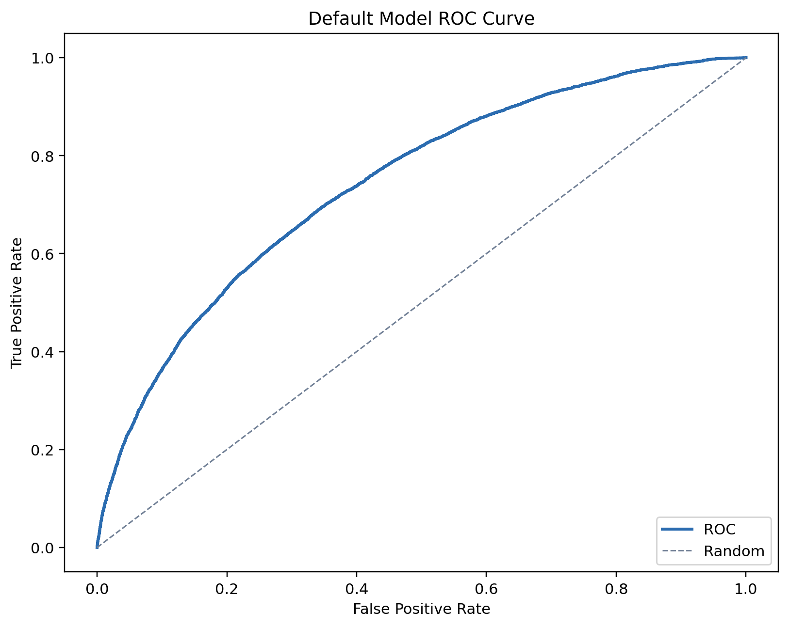
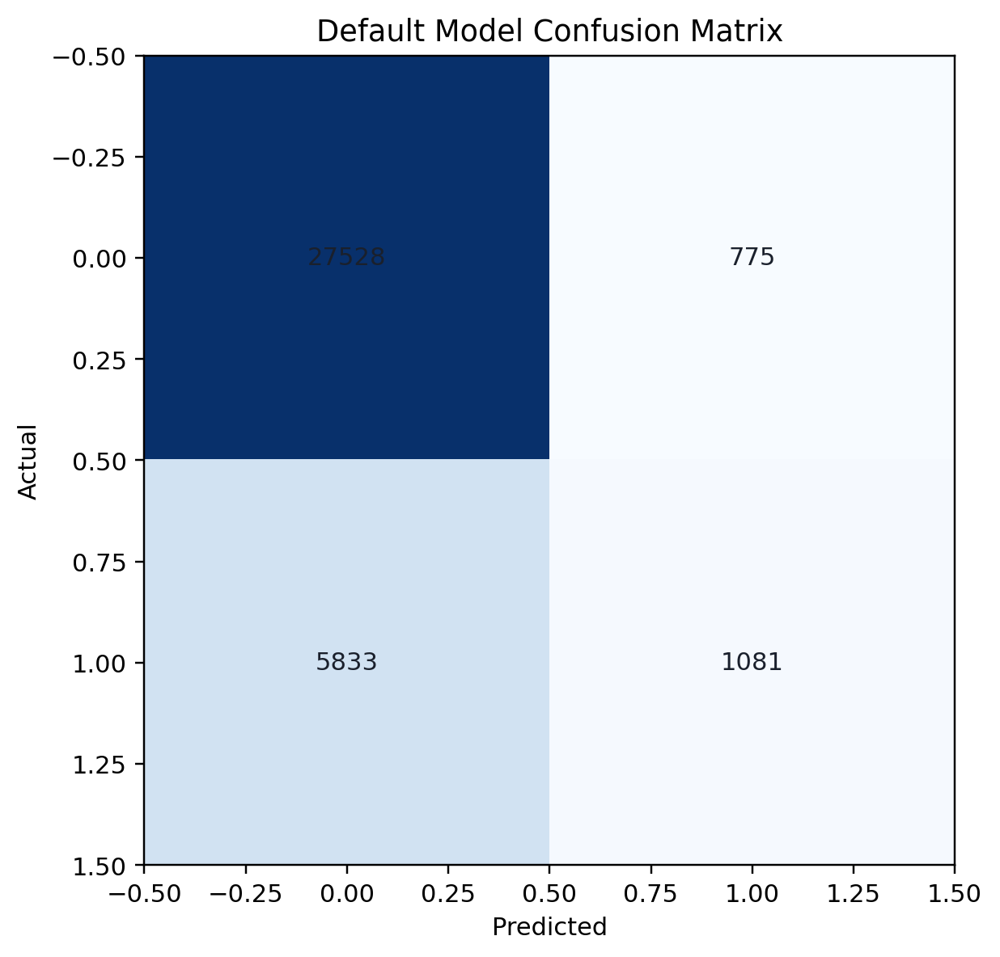
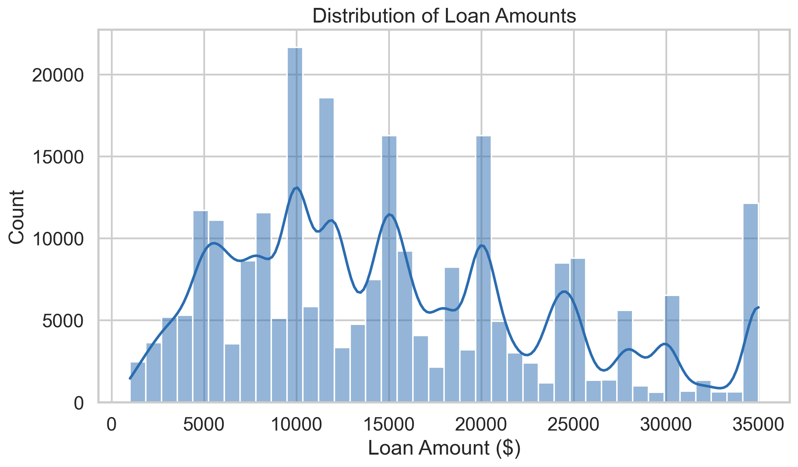
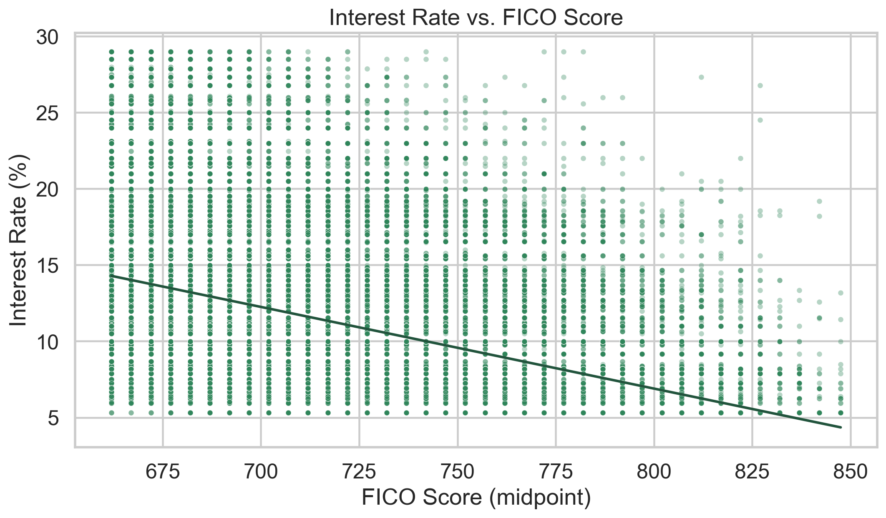
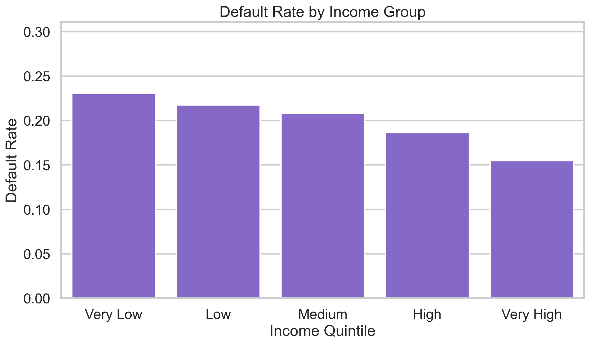
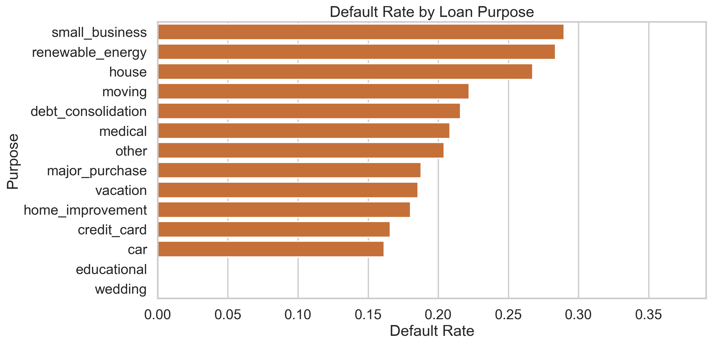
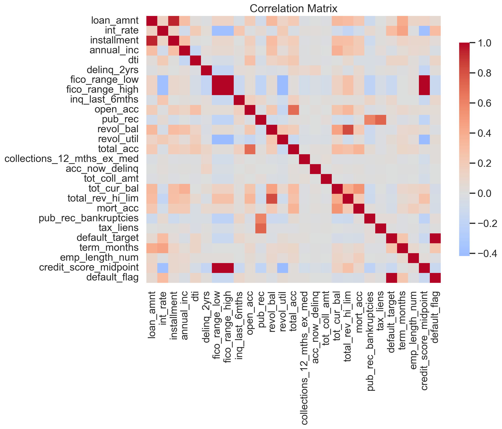

# Data-Driven Loan Matching and Credit Decision Platform

## 1. Executive Summary
This project implements an end-to-end loan decisioning and matching system. Given a borrower application, the platform:

- Estimates approval probability using a supervised model trained on accepted vs. rejected applications
- Predicts an interest rate consistent with the borrower’s risk profile (risk-based pricing)
- Estimates probability of default for funded loans
- Generates lender offers by applying lender constraints and risk premiums on top of the model-predicted base rate

The system is exposed through a FastAPI service and a static frontend served from `docs/`.

## 2. Data and Targets
The pipeline is designed around two LendingClub-style tables:

- **Accepted / funded loans**: rich borrower + loan attributes and a loan outcome (`loan_status`)
- **Rejected applications**: a smaller schema but crucial negative examples for the approval model

When available, the system uses the real LendingClub accepted/rejected datasets (2007–2018Q4) placed in `data/raw/`. Synthetic LendingClub-like data is only a fallback so the system can run end-to-end if raw files are missing.

### 2.1 Outcomes
The code constructs targets as follows:

- **Default target** (`default_target`): derived from `loan_status` (Fully Paid → 0, Charged Off/Default → 1; “Current” and other non-final statuses are ignored for default training)
- **Interest rate target** (`int_rate_target`): preserved copy of `int_rate` before preprocessing
- **Approval target** (`accepted`): 1 for funded loans and 0 for rejected applications

## 3. Feature Engineering and Preprocessing
Feature engineering is implemented in [feature_engineering.py](../src/feature_engineering.py) and is intentionally split into two pipelines:

### 3.1 Approval Features (Accepted + Rejected)
The approval dataset is standardized to common fields:

- Numeric: `amount`, `risk_score`, `dti`, `emp_length_num`
- Categorical: `state`

Preprocessing uses median imputation + standard scaling for numeric features and one-hot encoding for state.

### 3.2 Risk/Pricing Features (Accepted Only)
For default risk and interest rate prediction, the project uses a richer feature set including:

- Credit profile: FICO average, delinquencies, inquiries, revol utilization, open/total accounts
- Affordability and ratios: loan-to-income, installment-to-income, revolving-balance-to-income
- Credit history length: months since earliest credit line
- Log transforms for skewed variables (income, revolving balance, total accounts)

All models are trained on the output of a `ColumnTransformer` that produces named features with `num__` / `cat__` prefixes. This keeps the inference pathway consistent and prevents accidental leakage of raw text fields.

## 4. Model Design
Model training lives in [model_training.py](../src/model_training.py). The current implementation uses scikit-learn Gradient Boosting models for a strong baseline without heavy dependencies.

### 4.1 Approval Model (Classification)
- **Algorithm**: `GradientBoostingClassifier`
- **Training data**: combined accepted + rejected applications
- **Output**: `approval_probability`
- **Figure**: feature importance (MDI)

**Figure 1 — Approval feature importance.** Higher-ranked features contribute more to the model’s split decisions. In practice, risk score (FICO-derived), DTI, amount, and employment length should dominate because they capture repayment capacity and historical credit quality.

### 4.2 Interest Rate Model (Regression)
- **Algorithm**: `GradientBoostingRegressor`
- **Training data**: accepted loans (target `int_rate_target`)
- **Leakage control**: drops `num__int_rate` from features during training to avoid training on the answer
- **Output**: `predicted_interest_rate`

If generated, the report includes a predicted-vs-actual diagnostic scatter:

**Figure 2 — Interest model predicted vs actual.** Points close to the diagonal indicate well-calibrated pricing predictions; systematic deviation suggests missing signals (e.g., grade/sub-grade, macro conditions) or a need for monotonic constraints.

### 4.3 Default Risk Model (Classification)
- **Algorithm**: `GradientBoostingClassifier`
- **Training data**: accepted loans where `default_target` is known (closed loans only)
- **Output**: `default_probability`

**Figure 3 — Default model ROC curve.** The ROC curve shows the trade-off between catching true defaults (TPR) and false alarms (FPR) as the decision threshold changes. A strong curve stays well above the diagonal baseline.

If generated, the confusion matrix provides thresholded performance at 0.5:

**Figure 4 — Default model confusion matrix (threshold = 0.5).** This view is useful for operational settings where a single cutoff drives downstream actions (pricing, decline, or manual review).

## 5. Exploratory Data Analysis (EDA)
EDA figures are produced by [eda.py](../src/eda.py) from the accepted-loans dataset.

**Figure 5 — Loan amount distribution.** Consumer lending typically shows a right-skewed distribution: many moderate loans and fewer large loans. This motivates log/ratio features and robust models.

**Figure 6 — Interest rate vs FICO score.** Higher FICO borrowers generally receive lower pricing. The fitted trend line makes this inverse relationship easier to see through the scatter.

**Figure 7 — Default rate by income group.** Income is a proxy for repayment capacity. A non-monotonic pattern may indicate confounding factors (loan purpose, amount requested) and supports multivariate modeling.

**Figure 8 — Default rate by purpose.** Some purposes (e.g., small business) often show higher risk than consolidation or credit card refinancing. This is one reason purpose is encoded as a categorical feature.

**Figure 9 — Correlation matrix (numeric features).** Correlation is not causation, but it helps identify redundancy and expected relationships (e.g., loan amount with installment; revolving metrics with utilization).

## 6. Lender Matching and Offer Construction
The lender matching engine is implemented in [lender_matching.py](../src/lender_matching.py).

1. **Hard constraints**: each lender declares minimum FICO, maximum DTI, minimum income, maximum loan amount, and allowed states
2. **Base rate prediction**: the interest model predicts a fair “market” rate
3. **Risk premium**: a premium is added based on predicted default probability
4. **Lender strategy spread**: lenders apply a static adjustment to reflect business strategy

The service returns a list of offers (rate, payment, and a confidence score based on default risk).

## 7. System Architecture
- **API**: FastAPI application defined in [api/index.py](../api/index.py)
- **Inference**: [PredictionService](../src/prediction_service.py) loads trained models and preprocessors from `models/` and produces end-to-end results
- **Frontend**: static interface in `docs/` served by FastAPI at `/`

## 8. Limitations and Next Steps
- Add probability calibration (Platt/Isotonic) for more reliable approval and default probabilities
- Evaluate fairness and disparate impact across protected attributes (requires careful data handling and governance)
- Introduce time-aware splits (vintage analysis) to reduce leakage from shifting macro conditions
- Extend lender simulation to include capital constraints, loss provisioning, and acquisition cost
